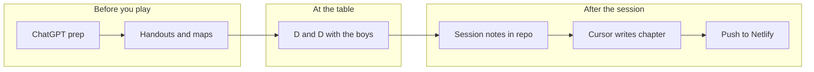

# How this project works

**The Ruins of Ethium** is the published story of your sons' D&D campaign — a novel the boys, parents, and friends can read. It is separate from the tools you use to *run* the game.

---

## Two jobs, two tools

| Job | Tool | What it does well |
|-----|------|-------------------|
| **Run the game** | ChatGPT | Session ideas, handouts, stat blocks, maps, item cards, DM notes |
| **Tell the story** | This repo + Cursor | Consistent novel prose, chapter pages, illustrations, Netlify site |

ChatGPT holds a lot of campaign memory and is brilliant for **prep**. It is weaker at **one consistent novel voice** across chapters — that is what this app is for.

You do not need to export everything from ChatGPT. After each session, a short “what happened” note is enough.

---

## Your loop (each session)



### Before the session (ChatGPT)

- Brainstorm encounters, NPCs, clues
- Generate printable handouts, item cards, trackers
- Keep using your existing Hellfire / Ruins of Ethium chats

Optional: paste useful bits into `source/chatgpt-exports/fragments/` or drop files in `source/inbox/`.

### At the table

- Play as you do now — preprinted boards, dice, silly ideas
- The **novel must stay faithful** to what actually happened (see `style-guide.md`)

### After the session (this repo)

1. **While it is fresh** — fill in `source/sessions/session-XX/what-happened.md`  
   Bullet points are fine: who fought what, funny lines, loot, decisions.

2. **Drop extras** — maps, photos of the table, ChatGPT exports → `inbox/` or `illustrations/`

3. **Ask Cursor** — e.g.  
   *"Write Chapter 3 from session-03 notes and style-guide.md"*

4. **Review** — read the draft; fix anything the table did differently

5. **Publish** — final text in `publish/chapters/`, `published: true`, then:
   ```bash
   node scripts/sync-publish.mjs
   git add -A && git commit -m "…" && git push origin main
   ```
   Netlify deploys automatically from **main**.

---

## What readers see

- A Fighting Fantasy–style site: prologue, chapters, about page with the cast
- New chapter after each session (or batch a long session into 2 chapters if needed)
- Audience: boys (~12), parents, friends — clear prose, real table humour, no graphic violence

---

## What stays private vs public

| Location | Audience |
|----------|----------|
| `publish/source/` | You + Cursor — notes, maps, ChatGPT fragments, DM detail |
| `publish/chapters/` | **Everyone** — the novel on the website |

Set `published: false` in a chapter frontmatter to keep a draft off the live site.

---

## Splitting long sessions

Session 3+ at the table covered a lot (manor → road → waterfall → tower). For readers, that can become **several short chapters** rather than one huge one. See `sessions/session-03/what-happened.md` for the suggested split.

---

## Quick links

- [Style guide](style-guide.md) — how chapters should read
- [Campaign bible](00-campaign-bible.md) — canon and timeline
- [Map catalog](world/maps/MAP-CATALOG.md) — images and maps
- [Publish folder README](../README.md) — folders and sync
