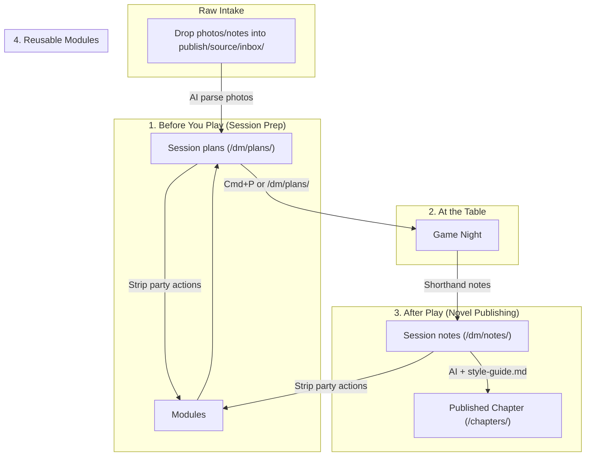

# How this project works

**The Ruins of Ethium** is the published story of your family D&D campaign.

## Terms (authoritative)

| Term | Path | Site | Purpose |
|------|------|------|---------|
| **Inbox (Raw Intake)** | `publish/source/inbox/` | *(Local only, ignored by git)* | Raw photos of handwritten notes, sketches, and map scans. Zero git bloat. |
| **Modules** | `publish/source/world/modules/` | `/dm/modules/` | **Replayability** — run again / publishable blocks. No party play log. |
| **Session plans** | `publish/source/session-plans/` · live `publish/table/` | `/dm/plans/` | **Prep for an upcoming session** (Cmd+P printable with HP tick-boxes). |
| **Session notes** | `publish/source/sessions/` | `/dm/notes/` | **What happened** → novel chapters. |
| **World** | `publish/source/world/notes/` · `characters/` | `/dm/world/` | Setting reference. |
| **CYOA** | `publish/source/cyoa/` | `/cyoa/` | Branching game rework (separate). |
| **Story** | `publish/chapters/` | `/chapters/` | Published novel. |

**DM hub (bookmark):** **`/dm/`** — also `/dungeonmaster/` → `/dm/`. Hidden from novel nav; `noindex`.  
**CYOA hub (bookmark):** **`/cyoa/`**. Hidden; `noindex`.

Assets: maps/PDFs sync to **`/dm/maps/`** · **`/dm/pdfs/`** (legacy `/table/maps|pdfs/` redirect).

---

## Your Author & DM Loop

```mermaid
flowchart TD
  subgraph Intake ["Raw Intake"]
    Inbox["Drop photos/notes into publish/source/inbox/"]
  end

  subgraph Before ["1. Before You Play (Session Prep)"]
    Modules["Modules"] --> Plans["Session plans (/dm/plans/)"]
    Inbox -->|AI parse photos| Plans
  end

  subgraph Table ["2. At the Table"]
    Plans -->|Cmd+P or /dm/plans/| Play["Game Night"]
  end

  subgraph After ["3. After Play (Novel Publishing)"]
    Play -->|Shorthand notes| Notes["Session notes (/dm/notes/)"]
    Notes -->|AI + style-guide.md| Chapter["Published Chapter (/chapters/)"]
  end

  subgraph Distill ["4. Reusable Modules"]
    Plans & Notes -->|Strip party actions| Modules
  end
```

### 1. Before — Session Plans & Maps
- Drop raw photos of handwritten prep notes or map scans into `publish/source/inbox/`.
- Ask Antigravity: *"Process inbox notes into a session plan for Session XX."*
- Live run sheets save to `publish/table/` $\rightarrow$ viewable at `/dm/plans/` and printable with HP tick-boxes (`Cmd+P`).

### 2. After — Session Notes & Novel Chapters
- Drop shorthand notes or bullet points of what happened into `publish/source/inbox/` or `publish/source/sessions/session-XX/what-happened.md`.
- Ask Antigravity: *"Write Chapter XX from session notes following `publish/source/style-guide.md`."*
- Published chapters appear in `publish/chapters/` $\rightarrow$ live at `/chapters/`.

### 3. Modularization — Replayable Blocks
- Periodically ask Antigravity: *"Amalgamate Session Plans XX-YY into a reusable module."*
- Clean adventure modules save to `publish/source/world/modules/` $\rightarrow$ live at `/dm/modules/`.

---

## Quick links

- [Prompts cheatsheet](PROMPTS.md) · [Inbox guide](inbox/README.md)
- [DM hub](/dm/) · [Modules](world/modules/) · [Session plans](session-plans/) · [Session notes](sessions/)
- [CYOA](cyoa/) → `/cyoa/`
- [Style guide](style-guide.md) · [Campaign bible](00-campaign-bible.md)
