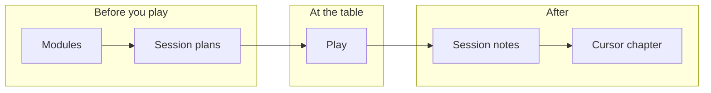

# How this project works

**The Ruins of Ethium** is the published story of your sons' D&D campaign.

## Terms (authoritative)

| Term | Path | Site | Purpose |
|------|------|------|---------|
| **Modules** | `publish/source/world/modules/` | `/dm/modules/` | **Replayability** — run again / publishable blocks. No party play log. |
| **Session plans** | `publish/source/session-plans/` · live `publish/table/` | `/dm/plans/` | **Prep for an upcoming session** |
| **Session notes** | `publish/source/sessions/` | `/dm/notes/` | **What happened** → novel chapters |
| **World** | `publish/source/world/notes/` · `characters/` | `/dm/world/` | Setting reference |
| **CYOA** | `publish/source/cyoa/` | `/cyoa/` | Branching game rework (separate) |
| **Story** | `publish/chapters/` | `/chapters/` | Published novel |

**DM hub (bookmark):** **`/dm/`** — also `/dungeonmaster/` → `/dm/`. Hidden from novel nav; `noindex`.

**CYOA hub (bookmark):** **`/cyoa/`**. Hidden; `noindex`.

Assets: maps/PDFs sync to **`/dm/maps/`** · **`/dm/pdfs/`** (legacy `/table/maps|pdfs/` redirect).

---

## Your loop

```mermaid
flowchart LR
  subgraph before [Before you play]
    Modules[Modules]
    Plans[Session plans]
  end
  subgraph table [At the table]
    Play[Play]
  end
  subgraph after [After]
    Notes[Session notes]
    Chapter[Cursor chapter]
  end
  Modules --> Plans
  Plans --> Play
  Play --> Notes
  Notes --> Chapter
```

### Before — session plans
- Pull from `/dm/modules/` or `world/modules/`
- Draft in `session-plans/`; live sheet in `publish/table/` → **`/dm/plans/`**

### After — session notes
1. `sessions/session-XX/what-happened.md`
2. Ask Cursor to write chapter from session notes + style guide
3. Publish in `publish/chapters/`

Do **not** paste “party did…” into modules.

---

## Quick links

- [DM hub](/dm/) · [Modules](world/modules/) · [Session plans](session-plans/) · [Session notes](sessions/)
- [CYOA](cyoa/) → `/cyoa/`
- [Style guide](style-guide.md) · [Campaign bible](00-campaign-bible.md)
