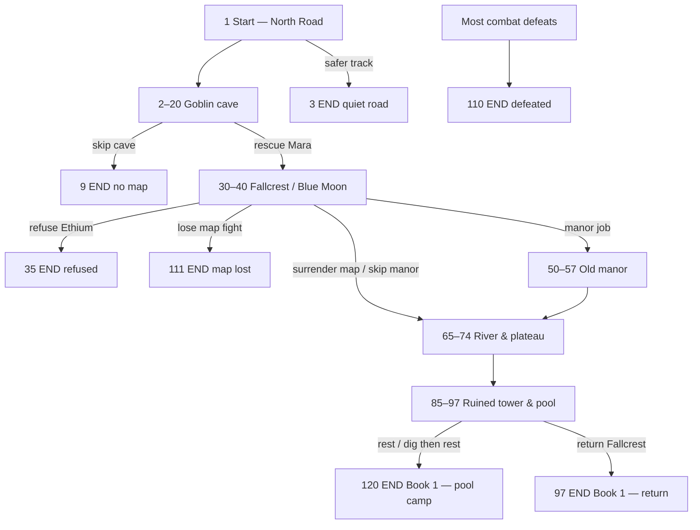
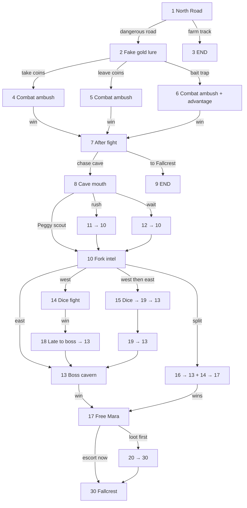
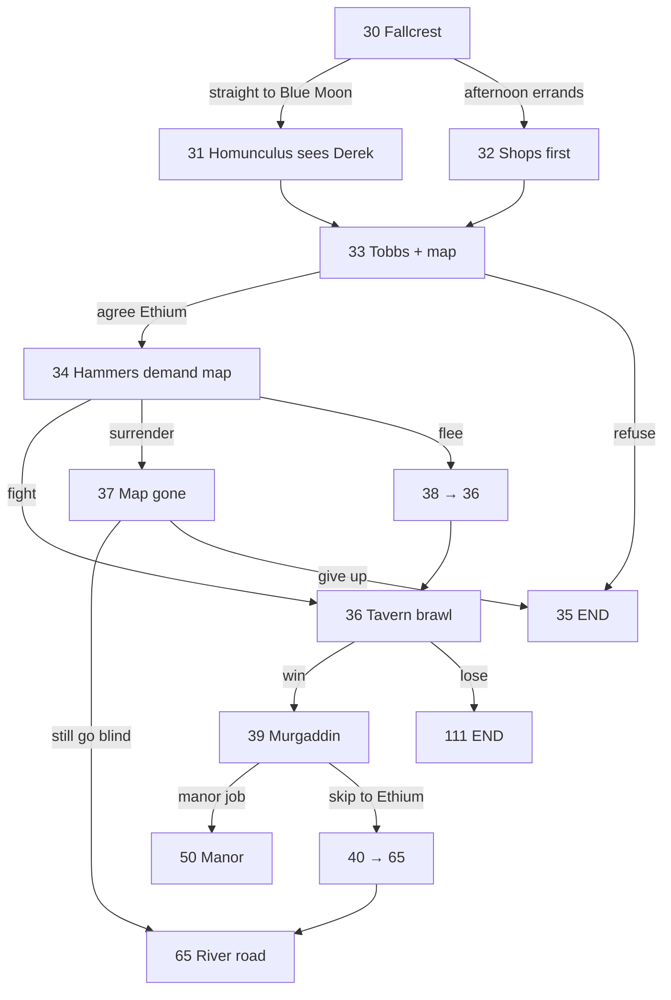
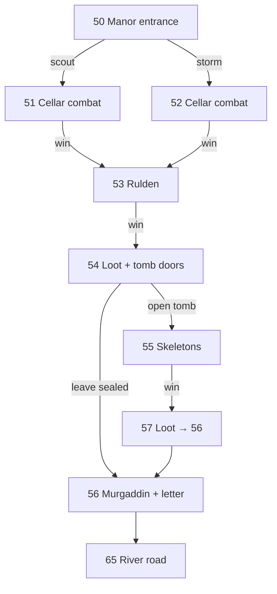
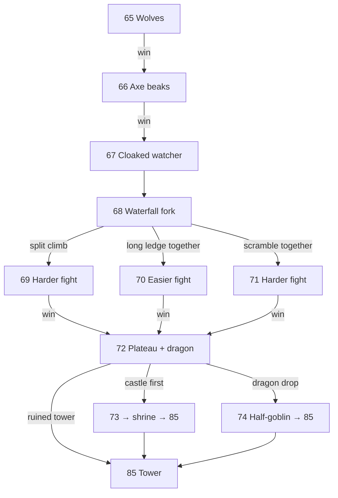
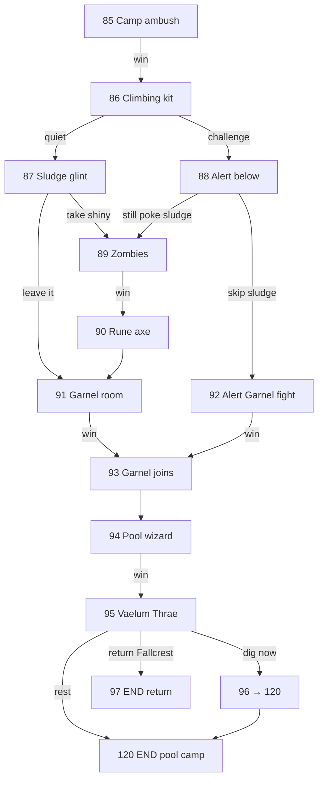

# Book 1 — choice flow

Diagrams of [`book-01-the-road-to-ethium.md`](book-01-the-road-to-ethium.md).  
Defeat in most combats goes to **110** (omitted from detail graphs to reduce clutter). Blue Moon lose → **111**.

---

## Overview (arcs)

---

## North Road & goblin cave (1–20)

---

## Fallcrest & Blue Moon (30–40)

---

## Old manor (50–57)

---

## River road, waterfall, plateau (65–74)

---

## Ruined tower & pool (85–120)

---

## Main “canonical” path (novel-like)

If you roughly follow the published chapters:

**1 → 2 → 5/6 → 7 → 8 → 10 → 16 → 17 → 30 → 32 → 33 → 34 → 36 → 39 → 50 → 51 → 53 → 54 → 55 → 56 → 65 → 68 → 69 → 72 → 85 → 87 → 89 → 91 → 93 → 94 → 95 → 120**
