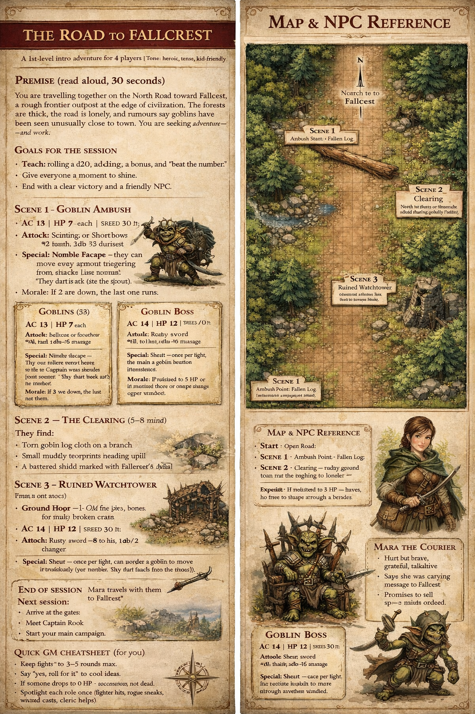
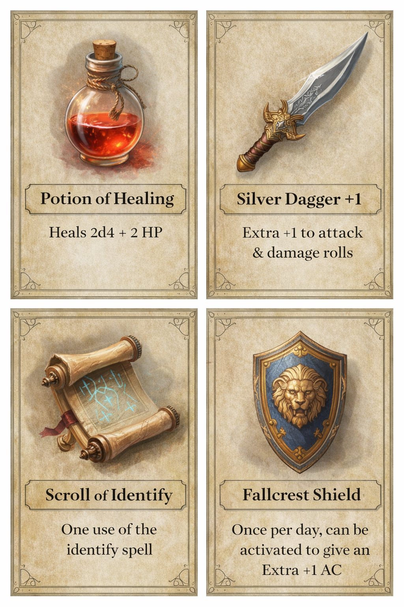

**A 1st-level intro adventure for 4 players | Tone: heroic, tense, kid-friendly**

---

## **Premise (read aloud, 30 seconds)**

You are travelling together on the North Road toward **Fallcrest**, a rough frontier outpost at the edge of civilisation. The forests are thick, the road is lonely, and rumours say goblins have been seen unusually close to town. You are seeking adventure — and work.

---

## **Goals for the session**

- Teach: rolling a d20, adding a bonus, and “beat the number.”
    
- Give everyone a moment to shine.
    
- End with a clear victory and a friendly NPC.
    

---

# **MAP KEY (your battle mat)**

From south to north:

1. **Start – Open Road**
    
2. **Ambush Point – Fallen Log + trees close to the path**
    
3. **Clearing – muddy ground, goblin tracks, trail up to tower**
    
4. **Ruined Watchtower – cracked stone base, broken upper floor**
    

---

# **SCENE 1 – GOBLIN AMBUSH (10–15 mins)**

### Read aloud

> “The forest grows darker. The wind drops. You hear snapping twigs… then silence.”

Ask:

- Who is in front?
    
- Who is keeping watch?
    

### What happens

**3 Goblins leap from the trees.** One shoots, then tries to run toward the clearing.

#### Tactics (simple)

- Goblins try to hit once, then duck behind trees.
    
- If one drops below half HP, it flees north.
    

---

### **Monster Stats – Goblins (x3)**

**AC** 13 | **HP** 7 each | **Speed** 30 ft  
**Attack:** Scimitar or Shortbow **+4 to hit**, **1d6+2** damage  
**Special:** Nimble Escape — they can move away without triggering extra attacks (just narrate “they dart back into the trees”).  
**Morale:** If 2 are down, the last one runs.

---

# **SCENE 2 – THE CLEARING (5–8 mins)**

They find:

- Torn goblin cloth on a branch
    
- Small muddy footprints heading uphill
    
- A battered shield marked with Fallcrest’s symbol
    

**Clue:** Something (or someone) was dragged toward the tower.

---

# **SCENE 3 – RUINED WATCHTOWER (main set piece)**

### Ground floor

- Old fire pit, junk, bones (animal), broken crates
    
- **1 Goblin Sentry** tries to run upstairs.
    

#### Goblin Sentry

Same stats as a normal goblin.

---

### Upper floor – boss encounter

You see a frightened courier tied to a post.

Enemies:

- **Goblin Boss**
    
- **1 Goblin Minion**
    

#### **Goblin Boss**

**AC** 14 | **HP** 12 | **Speed** 30 ft  
**Attack:** Rusty sword **+4 to hit**, **1d8+2** damage  
**Special:** Shout — once per fight, can order a goblin to move immediately.  
**Morale:** If reduced to 5 HP or fewer, he tries to escape through a broken window.

#### **Goblin Minion**

Use normal goblin stats.

**Fail-safe:**  
If the fight is going badly for the party, have the boss threaten the captive instead of attacking — this buys time and keeps it dramatic, not deadly.

---

# **NPC – MARA THE COURIER (friendly)**

- Hurt but brave, grateful, talkative
    
- Says she was carrying messages to Fallcrest
    
- Promises to tell the **Captain of the Watch** about the heroes
    

**When rescued (read aloud):**

> “Fallcrest needs people like you. You’re heroes of the North Road!”

---

# **REWARDS (pick one)**

Give the party **one shared reward**:

1. **Silver Goblin Dagger** (worth gold in Fallcrest)
    
2. **Charm of Bravery** – once per day, re-roll one failed saving throw
    
3. **Shield of Fallcrest** – +1 AC for one future fight
    

Plus: each player gets **1 inspiration** for bravery or creativity.

---

# **END OF SESSION**

Mara travels with them to Fallcrest. Next session:

- Arrive at the gates
    
- Meet Captain Rook
    
- Start your main campaign.
    

---

# **Quick GM cheatsheet (for you)**

- Keep fights to 3–5 rounds max.
    
- Say “yes, roll for it” to cool ideas.
    
- If someone drops to 0 HP → unconscious, not dead.
    
- Spotlight each role once (fighter hits, rogue sneaks, wizard casts, cleric helps).

