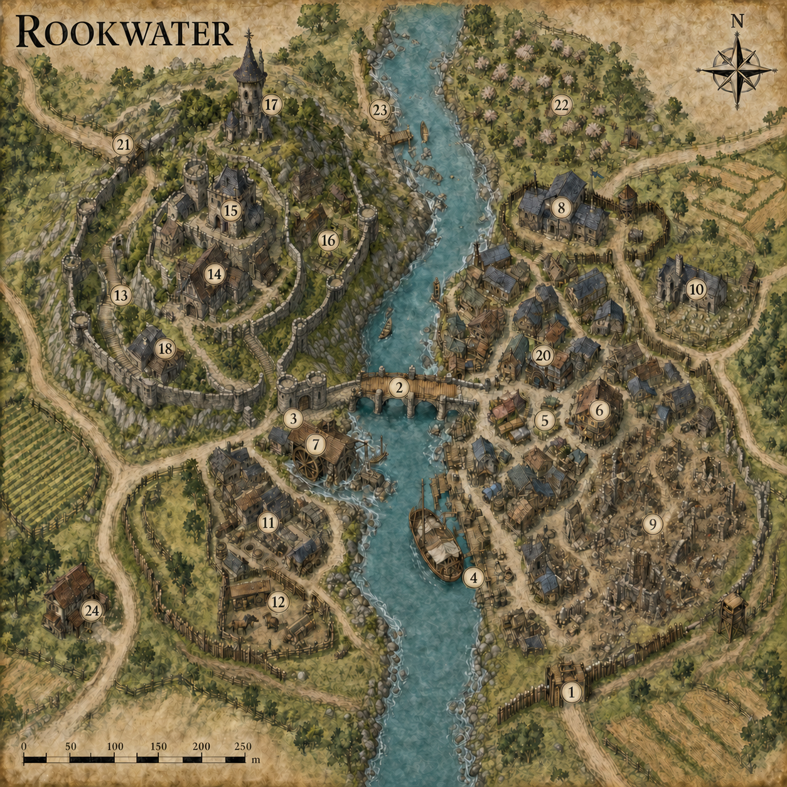

# Rookwater

*A frontier river town of Almenor*

## At a Glance

| Detail | Description |
|---|---|
| Population | Approximately 1,350, rising to nearly 1,600 during the autumn trade fairs |
| Government | Elected mayor advised by the Ward Table |
| Mayor | Celandra Vale, former river factor and practical civic reformer |
| Principal authority | Mayor Vale and Captain Branna Holt of the town watch |
| Wizard | Master Elian Voss, astronomer and keeper of Starling Spire |
| Wizard's apprentice | Pippa Reed, an inquisitive young halfling messenger and hedge-mage |
| River | The River Orrel, flowing south through Almenor |
| Main trade | Wool, timber, iron fittings, orchard fruit, lamp oil, river freight |
| Defences | Crown Hill wall, Southroad palisade, Eastwatch earthworks and about sixty guards |
| Character | Hospitable, industrious and visibly unfinished |

## The Town

Rookwater stands where the north road crosses the River Orrel on its long journey south through Almenor. Barges can travel between the town and the richer southern districts for most of the year, making Rookwater the last dependable market before the roads enter the sparsely settled northern marches. Wool, timber and iron come down from the uplands; grain, wine, worked cloth and lamp oil arrive from the south.

The town is home to roughly thirteen hundred and fifty people. Most live in the riverside wards, while the oldest families, civic officers and wealthier merchants occupy Crown Hill on the western bank. The hill is not a sheer cliff but a long, defensible ridge reached by a broad stair and two winding roads. Its old curtain wall can shelter much of the population during an attack.

Rookwater is welcoming without being careless. Travellers are greeted, asked their business and usually pointed toward food and lodging before anyone thinks to be suspicious. The guard wear dark green coats with a small silver rook clasp. They are expected to give directions, settle minor disputes and help with river accidents as readily as they arrest thieves.

The town still bears the wounds of the Ash-Hand raids. A century ago, several goblin clans united under a war-leader whose followers marked their shields with grey handprints. They crossed the eastern farms at night, burned the lower ward and attempted to seize the bridge. The defenders held Crown Hill, but nearly a third of the town was destroyed. Rookwater recovered slowly. The southeastern quarter remains a mixture of occupied houses, roofless shells, kitchen gardens and fire-blackened foundations.

Locals call this district the Goblin-Ruin Ward. Mayor Celandra Vale wants it rebuilt, but some residents resist. Poor families use the abandoned plots without paying rent, salvagers earn a living among the cellars, and old tunnels beneath the ruins have never been fully explored.

## The River Orrel

The Orrel is broad, cold and normally gentle at Rookwater. North of the bridge it runs between stony banks; south of the mill it deepens enough for shallow-draught cargo boats. Most freight travels downstream to the southern markets of Almenor. Barges returning north are commonly hauled by mules along the western towpath.

Spring meltwater can raise the river by six feet. Blue-and-white flood marks painted on the Tollhouse record the worst years. A bell at the South Quay warns of floating trees, broken barges and sudden floods.

## Government and Law

Rookwater elects a mayor every five years from among householders and recognised guild members. **Mayor Celandra Vale** is in the third year of her first term. She is a patient negotiator with an excellent memory for debts, promises and shipping prices. Vale would rather solve a problem with a work crew or a written agreement than a prison cell.

The mayor meets twice weekly with the **Ward Table**: six representatives chosen by Crown Hill, Reedmarket, Southbank, Eastwatch, the Quays and the outlying farms. Their arguments are public and often lively.

Serious crimes are heard in Mayor's Hall. Lesser offences usually result in restitution, public labour or loss of trading privileges. The town has four secure cells beneath Eastwatch Barracks, but Captain Holt dislikes keeping anyone there longer than necessary.

## The Rookwater Guard

Captain **Branna Holt** commands sixty full-time guards, supplemented by local volunteers during floods, fires and attacks. Holt is a broad-shouldered human woman with close-cropped grey hair and a calm manner. She encourages her guards to learn the names of shopkeepers, boat crews and local children.

Visitors generally encounter helpful guards rather than obstructive ones. They will escort lost travellers after dark, arrange a healer, help repair a wagon blocking the bridge or recommend an honest inn. They become firm when weapons are drawn in anger or when anyone interferes with river traffic.

## Master and Apprentice

**Master Elian Voss** occupies Starling Spire, a crooked tower built by an unknown surveyor long before Rookwater existed. Voss is an elderly human wizard, astronomer and collector of old road records. He is vain about his learning but fundamentally decent. His magic is strongest in wards, translation, distant observation and the study of strange lights in the sky. He advises the town on supernatural threats but holds no formal office.

His apprentice, **Pippa Reed**, is a young halfling with untidy auburn hair, quick hands and an inexhaustible curiosity. She carries messages for the mayor, repairs minor charms and knows every shortcut in town. Pippa is sociable where Voss is reserved. Adventurers are far more likely to receive a useful lead from her than a straight answer from her master.

Voss believes several pre-Almenoran roads once met beneath Crown Hill. Pippa suspects the sealed chambers below the Goblin-Ruin Ward connect to them.

## Customs and Everyday Life

- Touching the carved rook on the bridge parapet is said to ensure a safe return.
- A green lantern outside a house means travellers may ask to purchase a meal.
- On the first market day of each month, the guard waive bridge tolls until noon.
- Children leave bright thread at Starling Spire during meteor showers.
- Nobody rings the South Quay flood bell as a joke. Even young children treat this rule seriously.

## Rumours

1. Blue fire has appeared behind bricked-up windows in the Goblin-Ruin Ward.
2. Pippa Reed bought three ancient brass keys and will not say what they open.
3. Someone has been changing old boundary records inside the Archive of Roads.
4. A barge reached the South Quay without crew or cargo, its deck covered in white river flowers.
5. Captain Holt believes a smuggling tunnel enters town beneath Tanner's Row.
6. Master Voss has charted a star that moves against the heavens.

# Numbered Locations

## 1. Southroad Gate

The southern road enters through a stout timber gate in the riverside palisade. Two green-coated guards are always on duty, although the gates remain open from dawn until the last evening barge is unloaded. A slate board lists road conditions, missing animals and paid work. Sergeant Olan Breck welcomes travellers politely and has an uncanny ability to identify overloaded wagons.

## 2. Rivergate Bridge

Three old stone piers support a broad timber roadway across the Orrel. The bridge has been rebuilt more than once, most recently after the eastern span was burned during the Ash-Hand raids. Wagons take turns crossing under the direction of bridge guards. A weathered stone rook carved into the western parapet is polished smooth by travellers' hands.

## 3. Tollhouse

This narrow stone building controls bridge traffic and serves as the town's customs office. The ground floor contains scales, cargo stamps and a public list of tolls. Upstairs, factor **Mera Dain** records every commercial boat and wagon entering town. Flood marks climb the outside wall nearly to the upper windows.

## 4. South Quay

Rookwater's busiest waterfront consists of timber wharves, cargo sheds and a heavy crane turned by a pair of patient oxen. Wool, apples, charcoal and sawn boards leave from here. Southern barges bring wine, pottery, lamp oil and news from Almenor. Quaymaster **Joric Pell** can find discreet passage for almost anyone, provided the journey is lawful.

## 5. Reedmarket

Canvas awnings fill this open square on market days. Farmers sell produce beside drovers, tinkers and river merchants. Permanent stone markers divide the licensed pitches, though spirited bargaining regularly spills into the surrounding streets. The central pump is topped by a bronze rook holding a key.

## 6. The Copper Kettle

The town's most popular inn is a broad, three-storey building overlooking Reedmarket. Proprietor **Ansa Marr** serves peppered stew, orchard cider and small copper kettles of hot spiced wine. Merchants use the private upstairs rooms, while guards and boat crews favour the long common tables. Pippa Reed is often found here trading harmless gossip for pastries.

## 7. Orrel Mill

A deep side-channel drives the mill's enormous undershot wheel. **Dorrin Kest**, a soft-spoken dwarf engineer, owns the mill and maintains much of Rookwater's lifting gear. A locked lower workshop contains experimental pumps commissioned by the mayor. At night, irregular knocking sometimes sounds from the stone foundations beneath the wheel.

## 8. Eastwatch Barracks

The largest guard post occupies an earthwork overlooking the eastern roads. It contains armouries, kitchens, training yards and four holding cells. Captain Branna Holt works from a modest room above the gate. Visitors seeking help are offered water and a seat before being questioned. A beacon tower can signal Crown Hill and nearby farms.

## 9. Goblin-Ruin Ward

Fire-blackened walls and empty foundations lie among newer cottages and vegetable plots. The district was never fully rebuilt after the raids a century ago. Salvagers explore old cellars under permits issued by Mayor's Hall, although illegal digging is common. Residents are poor but close-knit and resent outsiders describing their neighbourhood as abandoned.

## 10. Ash Chapel

Built around the scorched remains of an older sanctuary, this plain stone chapel honours the unnamed townsfolk who died in the raids. It is not dedicated to a single deity. Keeper **Sella Venn** welcomes worshippers of any peaceful faith and maintains a garden of grey-leaved herbs used for burns and fever.

## 11. Tanner's Row

Leatherworkers, dyers and chandlers occupy the western downstream ward, where river breezes carry the worst smells away from the market. The guild drains its waste through inspected settling pits rather than directly into the Orrel. Beneath the oldest tannery is a disused brick conduit large enough for a crouching person.

## 12. Southbank Stables

These clean, practical stables serve caravan traffic and the western towpath. Stablemaster **Hob Arlen** rents riding horses, mules and two heavy wagons. He refuses to hire an animal to anyone he considers cruel or dangerously foolish. A fenced paddock can accommodate travelling mounts for a modest fee.

## 13. Crown Stair

One hundred and twelve shallow stone steps climb from the bridge road to Crown Hill. Small landings provide views across the roofs and river. During emergencies, iron gates at the top and bottom can seal the stair. Local tradition holds that newly elected mayors must climb it carrying the town ledgers without assistance.

## 14. Mayor's Hall

This half-timbered civic hall contains the mayor's office, public court, tax room and meeting chamber of the Ward Table. Mayor Celandra Vale keeps the main doors open during daylight. Notices are posted beneath the arcade, including bounties, contracts and requests for adventurers. The cellar holds emergency grain rather than prisoners.

## 15. Crown Hill Keep

The compact old keep is Rookwater's final refuge. Its courtyard contains wells, storehouses and enough covered space to shelter hundreds during an attack. Most rooms now serve as armouries and guard quarters. The upper hall is opened for winter feasts. A sealed postern allegedly leads to an overgrown ravine west of town.

## 16. Lantern Court

Merchants and skilled craftspeople live around this quiet square inside the hill wall. Iron brackets support coloured lanterns maintained by each household. The court hosts evening music during summer and a lantern procession every autumn to commemorate the town's survival.

## 17. Starling Spire

The wizard's tower rises from exposed rock north of the hill wall. Its narrow upper levels lean subtly eastward without collapsing. Bronze birds turn on rods around the roof, tracking winds and magical disturbances. Master Elian Voss receives visitors by appointment; Pippa Reed receives them whenever she notices them knocking. The cellar door has no visible hinges and predates the rest of the tower.

## 18. Archive of Roads

This squat fireproof building preserves charters, maps, bridge accounts and records from abandoned northern settlements. Archivist **Beren Saye** is suspicious of ink, candles, food and unsupervised researchers. The oldest maps show roads that no longer exist and omit several ruins known to local hunters.

## 19. Shrine of the Hearth

A circular open shrine surrounds an ever-burning civic flame. Residents make offerings here before journeys, marriages and major building work. Priest **Mother Halen** is an excellent mediator and sometimes accompanies guards during tense disputes. In an emergency, the shrine courtyard becomes a field hospital.

## 20. Rookwater Smithy

The rhythmic hammering from **Kara Flint's** forge can be heard across Reedmarket. Flint produces tools, boat fittings and sturdy weapons without ornament. Her apprentices also repair armour for the watch. Mounted over the door is a goblin blade recovered during the final defence of the bridge.

## 21. North Gate

A narrow gate and watch platform control the upland road beyond Crown Hill. It closes at sunset except for expected caravans. Guards keep a kettle on the brazier and routinely offer hot tea to wet travellers. The northern milestone was recently turned around, pointing toward a road that does not exist.

## 22. Willowbank Orchard

Terraced orchards cover the gentler eastern bank above town. The **Fenlow family** produces apples, pale cider and a strong spirit called rookfire. Seasonal workers camp among the lower trees during harvest. A stone-lined well at the orchard's northern edge remains cold even in midsummer.

## 23. Old Ferry Landing

Before the bridge was built, a rope ferry crossed at this stony bend. Only a short jetty, a winch post and the ferryman's ruined cottage remain. Fisherfolk still launch small boats here. On foggy mornings, some claim to hear a ferry bell from the empty river.

## 24. The Wayfarer's Rest

This inexpensive roadside inn stands just beyond the western palisade. It serves drovers, pilgrims and travellers who arrive after the gates close. Proprietor **Tamas Quill** is a retired guard who keeps spare blankets, basic medicines and an informal list of reliable guides. The inn's common room is rowdy but rarely dangerous.

## Using Rookwater

Rookwater works as a campaign base for characters beginning their careers. It offers safety, supplies and friendly authorities without being free of danger. The open roads lead north toward unsettled country, while the Orrel provides a reliable connection to southern Almenor. Immediate adventures can grow from the unexplored raid cellars, suspicious road records, river traffic, Master Voss's studies or Pippa's energetic curiosity.

The town should feel worth protecting. Its problems arise from age, limited resources and the hazards of the frontier rather than universal corruption. Most residents will help adventurers who demonstrate good intentions, and successful characters can see their actions visibly improve the town.
